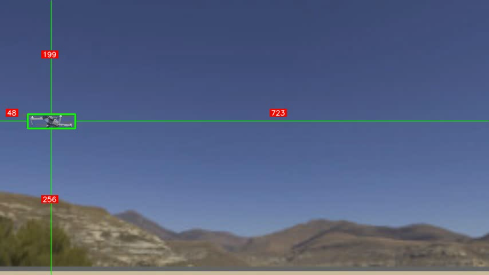

# uav-yolov11-kalman-filter

# UAV Object Distance and Position Estimation using Kalman Filter and YOLOv11 object detection

This repository contains a complete implementation of **object tracking and distance estimation system** for UAV (drone) applications. The system combines **YOLOv11** object detection, **Kalman Filter–based smoothing**, and **triangulation from dual perspectives** to achieve robust position estimation from aerial video streams.

---

## 📘 Overview

The project estimates:
- **Object distance** relative to the drone camera, derived from object bounding box size and frame scale calibration.
- **Object 2D position** (top-view coordinates) using **stereo triangulation** from two camera perspectives.
- **Filtered trajectory** using a **Kalman Filter**, which stabilizes noisy detections and provides predictive tracking when detections are lost.

---

## System Architecture

1. **YOLOv11 Inference**  
   Detects target objects (e.g., vehicles, people) from UAV camera feeds.

2. **Kalman Filtering**  
   Applies 1D or 2D Kalman filters to smooth the estimated distance or position.

3. **Triangulation**  
   Combines left–right camera detections to estimate the object’s 2D ground position.

---

## Sample:

  
  &nbsp;
  

  <em>Left: Left perspective detection — Right: Right Perspective detection</em>

